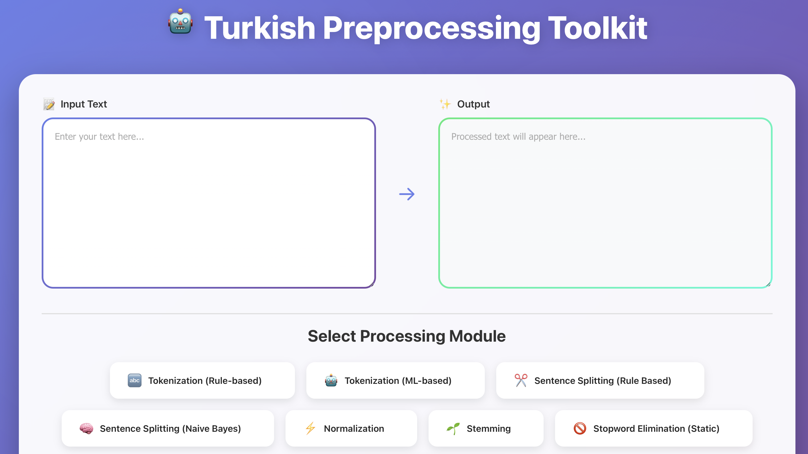

# Turkish Text Preprocessing Toolkit

A web application for Turkish text preprocessing including tokenization, stemming, normalization, and stopword removal.

Developed by [Atahan Uz](https://www.linkedin.com/in/atahan-uz/) and [Gizem Yılmaz](https://www.linkedin.com/in/gizem7/)



## Paper

[View Paper (PDF)](Paper.pdf)

## Prerequisites

- Python 3.x
- Node.js and npm
- Docker (optional)

## Installation

1. Install Python dependencies:

```bash
pip install flask flask-cors
```

2. Install React dependencies:

```bash
cd GUI
npm install
cd ..
```

3. Run BOUN TULAP Morphological Parser (Optional)

   This step is optional but recommended as it will improve the accuracy of the Normalizer.

   Repository: https://github.com/BOUN-TABILab-TULAP/Morphological-Parser

   Follow the instructions in the repository to install and run the Docker container.

   Test that it's working with this command:

   ```bash
   curl -X POST http://localhost:4444/evaluate \
   -H 'Content-Type: application/json' \
   -d '{"textarea":"Genç çellistin büyük heyecan ve duyarlılıkla çalmasına salondaki seyirciler hayran oldu ."}'
   ```

## Running the App

Simply run the following command:

```bash
python START.py
```

This will start both the Python backend server and the React frontend automatically.

The app will be available at: `http://localhost:3000`

**To stop:** Press `Ctrl+C` to stop both processes.

## Training codes

In the training_test_codes folder, you can find the scripts used to train the models and evaluate their performance. For Naive Bayes, no additional training code is provided, as training is so fast that it is performed during inference.

## Credits

Prof. Tunga Güngör for his help during the project

[Boğaziçi University TULAP](https://tulap.cmpe.boun.edu.tr) for the morphological analyser

Follow us at:
https://tabilab.cmpe.bogazici.edu.tr
